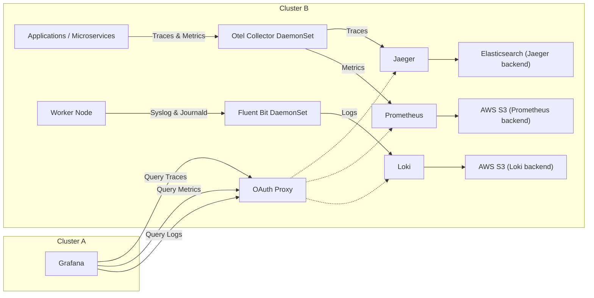

# OpenTelemetry Observability Stack

This repository contains a comprehensive observability stack for Kubernetes environments, featuring OpenTelemetry, Prometheus, Grafana, Jaeger, and Loki with Fluent Bit for log aggregation.

## Architecture Overview



The stack consists of the following components:

- **OpenTelemetry Collector**: Collects, processes, and exports telemetry data (metrics, traces, logs)
- **Prometheus**: Metrics collection and storage
- **Grafana**: Visualization and dashboards with pre-configured datasources
- **Jaeger**: Distributed tracing with Elasticsearch backend
- **Loki**: Log aggregation and storage with S3 backend
- **Fluent Bit**: Log collection and forwarding to Loki
- **OAuth Proxy**: Authentication layer for secure access to observability tools

## Directory Structure

```
├── base/                           # Base Kubernetes manifests
│   ├── jaeger/                    # Jaeger tracing setup with Elasticsearch
│   ├── logs/                      # Loki and Fluent Bit configurations
│   ├── oauth-proxy/               # OAuth proxy for secure access
│   │   ├── jaeger/                # OAuth proxy for Jaeger
│   │   ├── loki/                  # OAuth proxy for Loki
│   │   └── prometheus/            # OAuth proxy for Prometheus
│   ├── opentelemetry/             # OpenTelemetry collector configuration
│   └── prometheus/                # Prometheus monitoring setup
├── overlays/                      # Kustomize overlays for environment-specific configs
│   ├── grafana/                   # Grafana datasource configurations
│   ├── logs/                      # Log-related overlay configurations
│   ├── opentelemetry/             # OpenTelemetry instrumentation configuration
│   └── prometheus/                # Prometheus configuration patches
├── validator.sh                   # Validation script
└── .gitignore                     # Git ignore rules
```

## Prerequisites

- Kubernetes cluster (OpenShift compatible)
- Helm 3.x
- kubectl or oc CLI configured to access your cluster
- S3-compatible storage for Loki (AWS S3, MinIO, etc.)
- Appropriate storage classes configured (e.g., `gp3-csi` for AWS)
- For OpenShift: Cluster admin privileges to manage Security Context Constraints (SCCs)

## Quick Start

### 1. Deploy with Kustomize

The repository uses Kustomize for deployment with the following structure:

**Overlays Configuration:**
The `overlays/kustomization.yaml` includes:
- Jaeger tracing
- OAuth Proxy for secure access
- OpenTelemetry collector
- Prometheus monitoring
- Grafana with custom datasource configurations
- Prometheus patches for environment-specific settings

```bash
# Deploy base components individually
kubectl apply -k base/jaeger/
kubectl apply -k base/oauth-proxy/
kubectl apply -k base/opentelemetry/
kubectl apply -k base/prometheus/

# Or deploy the complete stack with overlays (recommended)
# This includes all components with environment-specific patches
kubectl apply -k overlays/
```

**Note:** The overlays deployment includes:
- Grafana with custom datasource configurations (Loki, Jaeger, Prometheus)
- OpenTelemetry instrumentation configurations
- Prometheus patches for optimized settings
- Consistent labeling across all components

**Labeling Strategy:**
All resources are labeled with consistent Kubernetes-standard labels for better organization and management:
- `app.kubernetes.io/part-of: observability-stack` - Applied to all resources
- `app.kubernetes.io/managed-by: kustomize` - Applied to all resources
- Component-specific labels:
  - Jaeger: `app.kubernetes.io/name: jaeger`, `app.kubernetes.io/component: tracing`
  - OpenTelemetry: `app.kubernetes.io/name: opentelemetry`, `app.kubernetes.io/component: collector`
  - Prometheus: `app.kubernetes.io/name: prometheus`, `app.kubernetes.io/component: monitoring`
  - Grafana: `app.kubernetes.io/name: grafana`, `app.kubernetes.io/component: visualization`
  - OAuth Proxy: `app.kubernetes.io/name: oauth-proxy-{service}`, `app.kubernetes.io/component: security`

### 2. Deploy Logging Stack with Helm

The logging components (Loki and Fluent Bit) can be deployed using Helm charts with the provided values files.

#### Deploy Loki

```bash
# Add Grafana Helm repository
helm repo add grafana https://grafana.github.io/helm-charts
helm repo update

# Create namespace
kubectl create namespace opentelemetry

# Configure S3 credentials (update the secret with your values)
kubectl apply -f base/logs/secret.yml -n opentelemetry

# Deploy Loki with custom values
helm upgrade --install loki grafana/loki-distributed \
  --namespace opentelemetry \
  --values base/logs/loki-values.yml

# For OpenShift, add required security context constraints
oc adm policy add-scc-to-user anyuid -z loki-loki-distributed
```

#### Deploy Fluent Bit

```bash
# Add Fluent Bit Helm repository
helm repo add fluent https://fluent.github.io/helm-charts
helm repo update

# Deploy Fluent Bit with custom values
helm upgrade --install fluentbit fluent/fluent-bit \
  --namespace opentelemetry \
  --values overlays/logs/fluentbit-values.yml

# For OpenShift, add required security context constraints
oc adm policy add-scc-to-user privileged -z fluent-bit
```

## Configuration Details

### Loki Configuration

The Loki setup includes:
- **Distributed architecture** with separate components (distributor, ingester, querier, compactor)
- **S3 storage backend** for long-term log retention
- **720-hour retention period** (30 days)
- **Persistent storage** for ingester and compactor components
- **Memberlist-based service discovery**

Key features:
- Horizontal scaling support
- S3-compatible object storage
- Built-in log retention and compaction
- Query optimization with caching

### Fluent Bit Configuration

The Fluent Bit setup provides:
- **DaemonSet deployment** for log collection from all nodes
- **Kubernetes metadata enrichment** with pod, namespace, and container information
- **Namespace filtering** (focuses on `qam` and `load-testing` namespaces)
- **OpenTelemetry trace correlation** with trace_id and span_id extraction
- **JSON log parsing** for structured logging
- **Loki output** with proper labeling for efficient querying
- **Storage configuration** with persistent buffer and checkpoint files
- **Resource limits** optimized for container environments

### OpenTelemetry Collector

Configured as a DaemonSet with:
- **OTLP receivers** (gRPC and HTTP)
- **Jaeger receivers** (gRPC, Thrift Compact, Thrift HTTP)
- **Host metrics collection** (CPU, memory, network, load)
- **Kubernetes attributes processor** for resource enrichment
- **Prometheus metrics export**
- **Zipkin trace export** to Jaeger

### Grafana Datasources

Pre-configured datasources for:
- **Prometheus**: Metrics visualization
- **Jaeger**: Distributed tracing
- **Loki**: Log exploration and correlation

## Security Configuration

### S3 Credentials

Before deploying Loki, update the S3 credentials in `base/logs/secret.yml`:

```yaml
apiVersion: v1
kind: Secret
metadata:
  name: grafana-loki-s3-secret
data:
  ACCESS_KEY_ID: <base64-encoded-access-key>
  ACCESS_KEY_SECRET: <base64-encoded-secret-key>
  BUCKETNAME: <base64-encoded-bucket-name>
  ENDPOINT: <base64-encoded-s3-endpoint>
  REGION: <base64-encoded-region>
type: Opaque
```

### OAuth Proxy

The repository includes OAuth proxy configurations for secure access to:
- Grafana dashboards
- Prometheus UI
- Loki query interface
- Jaeger UI

## Monitoring and Observability

### Metrics Collection

- **Application metrics**: Collected via OpenTelemetry instrumentation
- **Infrastructure metrics**: Host metrics from OpenTelemetry collector
- **Kubernetes metrics**: Service monitors and pod metrics

### Distributed Tracing

- **Trace collection**: Via OpenTelemetry and Jaeger protocols
- **Trace storage**: Elasticsearch backend for Jaeger
- **Trace correlation**: Automatic correlation with logs via trace_id

### Log Aggregation

- **Log collection**: Fluent Bit collects from container logs
- **Log enrichment**: Kubernetes metadata and OpenTelemetry correlation
- **Log storage**: Loki with S3 backend for scalability
- **Log retention**: 30-day retention with automatic cleanup

## Customization

### Environment-Specific Configurations

The repository uses Kustomize overlays for environment-specific configurations. The main overlay includes:

- Grafana with pre-configured datasources
- OpenTelemetry instrumentation settings
- Prometheus configuration patches

```bash
# Deploy with overlays (includes all customizations)
kubectl apply -k overlays/
```

For different environments, you can create additional overlay directories following the same pattern.

### Scaling Considerations

For production deployments, consider:
- Increasing Loki component replicas
- Adjusting resource limits based on log volume
- Configuring appropriate storage classes
- Setting up monitoring for the observability stack itself

## Troubleshooting

### Common Issues

1. **Loki ingester issues**: Check persistent volume claims and storage class availability
2. **Fluent Bit parsing errors**: Verify log format and parser configurations
3. **S3 connectivity**: Ensure proper credentials and network access to S3
4. **High memory usage**: Adjust buffer sizes and batch configurations

### Validation

Use the provided validation script:

```bash
./validator.sh
```

### Logs and Debugging

Check component logs:

```bash
# Loki components
kubectl logs -l app.kubernetes.io/name=loki -n opentelemetry

# Fluent Bit
kubectl logs -l app.kubernetes.io/name=fluent-bit -n opentelemetry

# OpenTelemetry Collector
kubectl logs -l app.kubernetes.io/name=opentelemetry-collector
```

## Contributing

1. Fork the repository
2. Create a feature branch
3. Make your changes
4. Test with the validation script
5. Submit a pull request

## License

This project is licensed under the terms specified in the repository.

## Support

For issues and questions:
- Check the troubleshooting section
- Review component logs
- Open an issue in the repository

---

**Note**: This observability stack is designed for OpenShift/Kubernetes environments and includes enterprise-ready features like OAuth authentication, persistent storage, and scalable architectures.